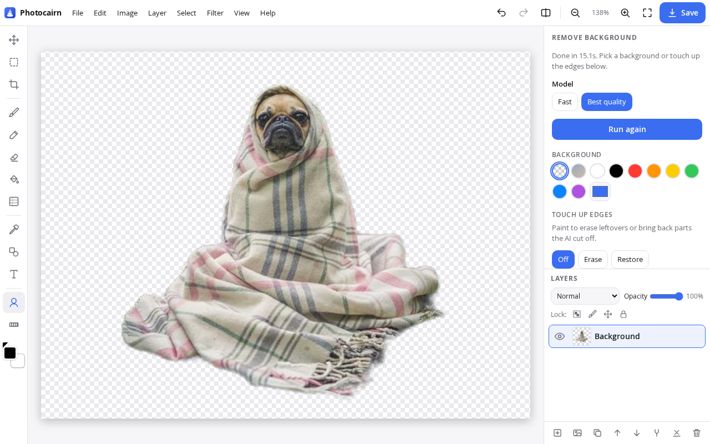

<p align="center"></p>

<h1 align="center">Photocairn</h1>

<p align="center"><b>Quick photo edits in your browser. No ads, no account, nothing uploaded.</b></p>

<p align="center"><a href="https://photocairn.silicairn.com/"><b>Open Photocairn →</b></a></p>

<p align="center"></p>

Sometimes you just need to cut out a background, crop a photo square or blur a name in a screenshot. You don't want to install Photoshop, start a trial, make an account or put up with an ad-covered "free" site that uploads your photo somewhere.

Photocairn is a fast, focused editor for exactly those jobs. **Everything runs on your device.** The AI background removal runs in your browser through WebAssembly. The page's security policy doesn't allow it to connect to any other server, so your photos stay with you.

## What it does

The layout will feel familiar if you've used Photoshop:
- a **menu bar** (File, Edit, Image, Layer, Select, Filter, View, Help)
- **tools** down the left
- on the right, the selected tool's **options** on top, then **History**, then **Layers**. Drag the lines between them to change their heights (double-click a line to reset it); the sizes are remembered.

On phones, the tools sit along the bottom and the options, history and layers share a tabbed sheet.

Related tools (brushes, selections, fills, shapes, blur out) share one toolbar button, marked with a small corner triangle. The button shows the tool in use; right-click (or long-press) it to pick another, or press its key again to cycle. The options panel then shows just that tool's settings.

**Files**
- Open PNG, JPG, WebP, AVIF, GIF and **PSD** (with layers). You can also drag & drop, paste from the clipboard, or start a **new blank image** (with presets; white, transparent or colored background).
- Save as PNG, JPG, WebP or **layered PSD** (opens in Photoshop, GIMP and Photopea), with quality and size sliders and a live file-size estimate, or copy to the clipboard. **Location and camera data (EXIF) are always removed.**

**Metadata remover** (File › Metadata, or from the start screen without opening the editor)
- Shows everything hidden in a JPEG, PNG or WebP:
  - **GPS location**, with a map link
  - camera make/model, lens and **serial numbers**, software
  - dates and times
  - author, captions and copyright
  - shooting settings
  - maker notes
  - the **embedded thumbnail**, which can show the photo before it was cropped
  - XMP, IPTC, comments, color profile
  - extra data after the image, such as motion-photo video
- Tick what to scrub, or use one click for *Private info*, *Everything* or *Nothing*, then download a cleaned copy.
- The image data is copied byte for byte, so there's **no re-compression**. Removing GPS leaves every other tag exactly as it was.
- When you open a photo that contains a GPS location, you get a warning.

**Edit**
- **Move** (V): drag a layer, or just the selected pixels. Arrow keys nudge.
- **Select** (M): rectangle, ellipse, lasso, polygon and magic wand (W) share one toolbar button; pick one by right-clicking (or long-pressing) the button, or with M / Shift+M. New, add, subtract and intersect modes. Also select all, invert, crop to selection, copy or cut to a new layer, fill, and delete. Painting, fills, adjustments and filters stay inside the selection.
- **Free transform** (Ctrl+T): scale, rotate, flip and move a layer or selection, using handles or exact numbers.
- **Crop**: free or preset ratios, plus straighten.
- **Rotate & flip**: 90° steps, horizontal/vertical flip or any angle, applied to the whole image or one layer.
- **Resize**: image size (scale), plus **canvas size** with an anchor to add space around the image without scaling it.

**Paint**
- **Brush tools** (B, Shift+B cycles):
  - **Brush**: size, hardness, opacity and color.
  - **Pencil** (N): hard, pixel-exact lines.
  - **Pen**: smooth, steadied ink lines for writing and signatures.
  - **Highlighter**: flat, see-through chisel tip that darkens what is under it.
- **Eraser** (E): soft or block.
- **Fill tools** (G, Shift+G cycles):
  - **Paint bucket** (K): tolerance, contiguous or global fill, and sample one layer or all layers.
  - **Gradient**: linear or radial, fading to the second color or to transparent.
- **Eyedropper** (I): average 1, 3×3 or 5×5 pixels.
- **Shapes** (U, Shift+U cycles): **Line**, **Arrow**, **Rectangle** and **Ellipse** (outlined or filled).
- **Text** (T): click to place text or drag to draw a text box, then drag to move it and drag the side handles to set the wrapping width. Font, font size, weight, italic, alignment, color, outline and background color. Each text is an editable text layer: click it with the Text tool (or double-click it) to change it later. Painting or filtering a text layer turns it into pixels.
- Main and second colors in the toolbar. X swaps them, D resets to black and white. Alt+click with the brush picks a color.

**Layers**
- Create, delete, duplicate, rename, reorder, show/hide, clear, merge down, merge visible and flatten.
- Each layer has its own opacity and blend mode (16 modes).
- **Locks** like Photoshop's: transparent pixels, image pixels, position, or all.

**Photo**
- **Remove background** with AI that runs on your device. *Fast* uses a 4.6 MB model and *Best quality* a 44 MB one. Afterwards you can pick a solid or blurred background and touch up with Erase/Restore brushes.
- **Adjust**: brightness, contrast, exposure, highlights, shadows, saturation, warmth, tint, sharpen and soften.
- **Filters**: Mono, Sepia, Vivid, Warm, Cool, Fade, Noir, Vintage and Invert, with a strength slider.
- **Blur out** faces, plates and private details: **Blur**, **Pixelate** and **Solid box** share one toolbar button.
- **Corners & border**: rounded corners, circle crop, and borders.

**Everywhere**
- Undo/redo, and a **History** panel like Photoshop's: one row per step (Brush, Fill, Merge down…), starting with the opened image. Click any step to go back to it, or a dimmed later step to redo up to it. Up to about 400 MB of image data is kept; older steps are dropped first.
- Hold to compare with the original.
- Zoom in/out, fit, 100% and pan (pinch on phones).
- Works offline and can be installed as an app.

## Privacy

- No uploads, accounts, analytics, ads or cookies.
- A strict Content-Security-Policy (`connect-src 'self'`) means the page *can't* send data to any other server, even by accident.
- The AI models and the WebAssembly runtime are served from the same site and then cached locally.

## Keyboard shortcuts

**Tools**
- `V`: Move
- `M`: Select tools (press again, or `Shift+M`, for Ellipse, Lasso, Polygon, Magic wand)
- `W`: Magic wand
- `Ctrl+T`: Transform
- `C`: Crop
- `B`: Brush tools (press again, or `Shift+B`, for Pencil, Pen, Highlighter)
- `N`: Pencil
- `E`: Eraser
- `G`: Fill tools (press again, or `Shift+G`, to switch between Paint bucket and Gradient)
- `K`: Paint bucket
- `I`: Eyedropper
- `U`: Shapes (press again, or `Shift+U`, for Line, Arrow, Rectangle, Ellipse)
- `T`: Text
- `L`: Layers

**Colors and brushes**
- `X`: swap colors
- `D`: reset colors to black and white
- `[` / `]`: brush size

**Selection**
- `Ctrl+A`: select all
- `Ctrl+D`: deselect
- `Ctrl+Shift+I`: invert selection
- `Ctrl+J`: copy the selection to a new layer
- `Delete`: delete the selected pixels

**File and history**
- `Ctrl+O`: open
- `Ctrl+S`: save
- `Ctrl+Z`: undo
- `Ctrl+Shift+Z` or `Ctrl+Y`: redo

**View**
- `0`: fit to screen
- `1`: 100%
- `+` / `−`: zoom
- Hold `Space`: pan
- Hold `\`: compare with the original

**In tools**
- `Enter`: apply
- `Esc`: cancel, or deselect

## For AI agents

AI agents that drive a browser (ChatGPT agent, Claude in Chrome, Playwright scripts) can edit images through `window.photocairn`, a small scripting API. Every method is async, takes JSON-friendly options in image pixels, and goes through the same code as the UI, so edits respect layers, the selection and locks, show up in History and can be undone.

```js
await photocairn.help();                              // every method, its parameters, ranges and defaults
await photocairn.open(dataUrl);
await photocairn.removeBackground({ model: "fast" });
await photocairn.redact({ x: 40, y: 300, width: 420, height: 60, mode: "box" });
const png = await photocairn.export({ format: "png" });
```

- [Developer & agent guide](https://photocairn.silicairn.com/developers/): every tool, shortcut and API method, with worked examples
- [llms.txt](https://photocairn.silicairn.com/llms.txt) and [llms-full.txt](https://photocairn.silicairn.com/llms-full.txt) for LLMs

The editing still runs on your device, but whatever AI is driving the browser can see the image.

The API is described in [`js/api-spec.js`](js/api-spec.js), which also generates `llms-full.txt` and `developers/index.html` (from [`scripts/docs-guide.md`](scripts/docs-guide.md)): run `npm run docs` after changing either.

## Run it yourself

There's no build step. It's plain HTML, CSS and JavaScript modules.

```bash
git clone https://github.com/apopov04/photocairn.git && cd photocairn
node tests/serve.mjs          # http://localhost:8080
```

Any static host works. To enable multi-threaded WebAssembly (faster background removal), serve it with the cross-origin isolation headers in [`_headers`](_headers), which Cloudflare and Netlify pick up automatically.

## Tests

```bash
npm test                      # unit tests: image operations, layers, text, history (Node, no dependencies)
npm i && CHROME=/path/to/chrome npm run test:e2e   # browser end-to-end scenarios
```

## How it's built

- `js/ops.js`: pure pixel operations (adjustments, filters, blur, sharpen, pixelate, mask handling). They don't touch the DOM, so they're unit-tested in Node.
- `js/editor.js`: the document model (layers plus memory-capped undo history) and the zoomable viewport. Layers are immutable snapshots, so undo stores references instead of pixel copies.
- `js/api.js`: `window.photocairn`, the scripting API for AI agents and automation. `js/api-spec.js` describes its methods and checks arguments; `scripts/api-docs.mjs` turns it into the docs.
- `js/history.js`: the History panel and the resizable right sidebar. History labels come from `doc.label("…")` at the commit site, or else the active tool's name.
- `js/tools.js`: the crop, resize, adjust, filters, text, layers and other panels. Each tool is a factory that builds its panel and handles pointer input in image coordinates.
- `js/text.js`: text layers. A text layer keeps its text, font, size, colors and box in `layer.meta.text` and is re-rendered from them, so it stays editable (word wrapping is unit-tested in Node).
- `js/paint.js`: the brush engine (stamped strokes with hardness and per-stroke opacity) and its variants (brush, pencil, pen, highlighter), eraser, shapes, paint bucket, gradient, eyedropper, selection, move and free transform. All pixel edits go through one function, which respects the selection and layer locks.
- `js/menus.js`: the menu bar (the same menus open from a single button on phones).
- `js/metadata.js`: dependency-free JPEG/PNG/WebP metadata parser and scrubber. It rebuilds EXIF tag by tag, recomputes PNG CRCs, and updates WebP's VP8X flags and RIFF size. `js/metadata-ui.js` is its dialog.
- `js/psd.js`: PSD import/export with [ag-psd](https://github.com/Agamnentzar/ag-psd), loaded only when needed.
- `js/bg-worker.js`: background removal in a Web Worker. It runs [U²-Net](https://github.com/xuebinqin/U-2-Net) models with [ONNX Runtime Web](https://onnxruntime.ai/), and the mask is upscaled and applied on a canvas.
- `sw.js`: service worker for offline use.

Third-party components and their licenses are listed in [THIRD_PARTY.md](THIRD_PARTY.md).

## License

[MIT](LICENSE)
